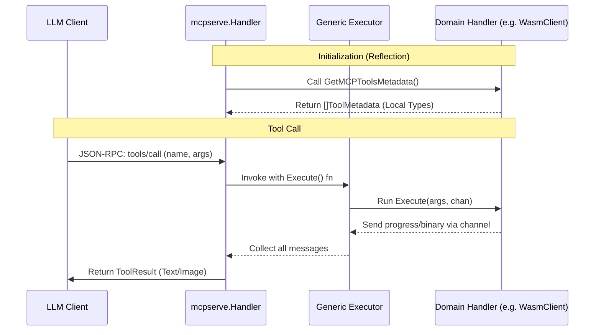

# MCP Flow Diagram

```mermaid
sequenceDiagram
    participant LLM as LLM Client
    participant SRV as mcpserve.Handler
    participant EXEC as Generic Executor
    participant DOM as Domain Handler (e.g. WasmClient)

    Note over SRV, DOM: Initialization (Reflection)
    SRV->>DOM: Call GetMCPToolsMetadata()
    DOM-->>SRV: Return []ToolMetadata (Local Types)

    Note over LLM, DOM: Tool Call
    LLM->>SRV: JSON-RPC: tools/call (name, args)
    SRV->>EXEC: Invoke with Execute() fn
    EXEC->>DOM: Run Execute(args, chan)
    DOM-->>EXEC: Send progress/binary via channel
    EXEC-->>SRV: Collect all messages
    SRV->>LLM: Return ToolResult (Text/Image)
```
