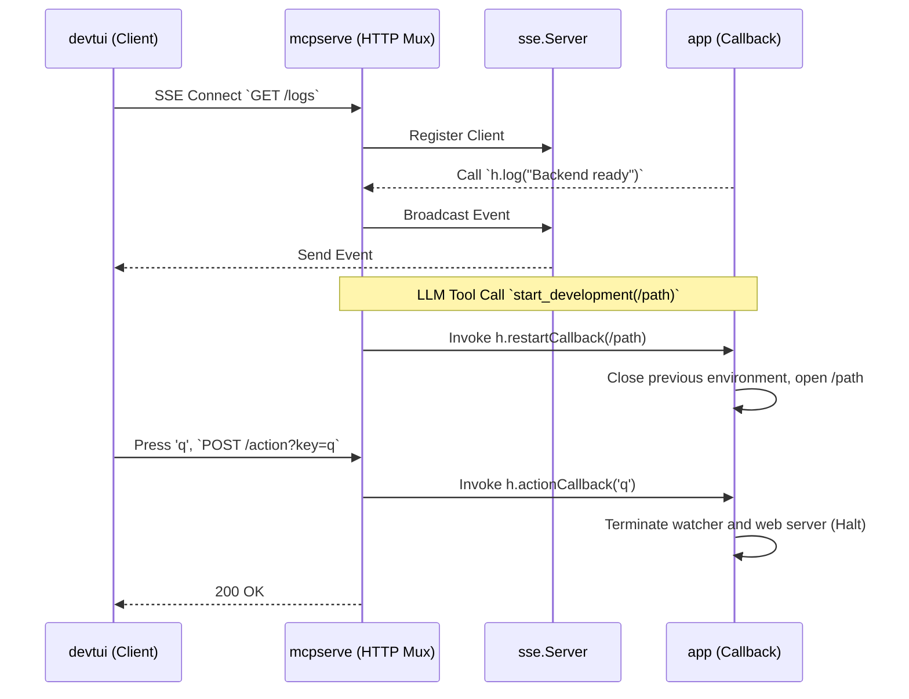

```mermaid
sequenceDiagram
    participant Bubble as devtui (Client)
    participant MCPServer as mcpserve (HTTP Mux)
    participant SSEHub as sse.Server
    participant App as app (Callback)

    %% Mux Routes %%
    Bubble->>MCPServer: SSE Connect `GET /logs`
    MCPServer->>SSEHub: Register Client
    
    App-->>MCPServer: Call `h.log("Backend ready")`
    MCPServer->>SSEHub: Broadcast Event
    SSEHub-->>Bubble: Send Event
    
    %% Handling tool_calls %%
    note over MCPServer, App: LLM Tool Call `start_development(/path)`
    MCPServer->>App: Invoke h.restartCallback(/path)
    App->>App: Close previous environment, open /path
    
    %% Handling Key Actions %%
    Bubble->>MCPServer: Press 'q', `POST /action?key=q`
    MCPServer->>App: Invoke h.actionCallback('q')
    App->>App: Terminate watcher and web server (Halt)
    MCPServer-->>Bubble: 200 OK
```
