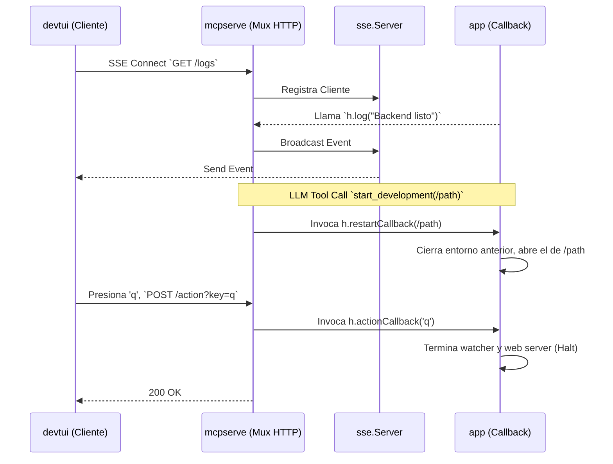

```mermaid
sequenceDiagram
    participant Bubble as devtui (Cliente)
    participant MCPServer as mcpserve (Mux HTTP)
    participant SSEHub as sse.Server
    participant App as app (Callback)

    %% Rutas del Mux %%
    Bubble->>MCPServer: SSE Connect `GET /logs`
    MCPServer->>SSEHub: Registra Cliente
    
    App-->>MCPServer: Llama `h.log("Backend listo")`
    MCPServer->>SSEHub: Broadcast Event
    SSEHub-->>Bubble: Send Event
    
    %% Manejo de tool_calls %%
    note over MCPServer, App: LLM Tool Call `start_development(/path)`
    MCPServer->>App: Invoca h.restartCallback(/path)
    App->>App: Cierra entorno anterior, abre el de /path
    
    %% Manejo de Key Actions %%
    Bubble->>MCPServer: Presiona 'q', `POST /action?key=q`
    MCPServer->>App: Invoca h.actionCallback('q')
    App->>App: Termina watcher y web server (Halt)
    MCPServer-->>Bubble: 200 OK
```
